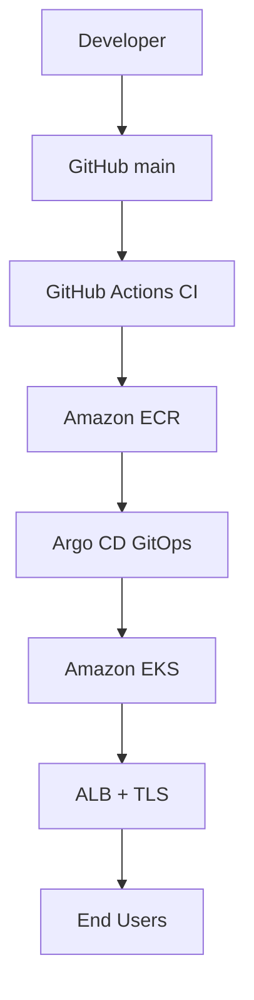

# Spring Platform

EKS 기반 GitOps 배포 아키텍처 설계 프로젝트

---

## Project Objective

이 프로젝트의 목적은 다음을 구현하는 것이다:

- CI와 CD를 명확히 분리한 배포 구조
- Git을 단일 진실 원천(Single Source of Truth)으로 사용하는 GitOps 아키텍처
- 클라우드 네이티브 환경에서 확장 가능한 애플리케이션 플랫폼 구성
- HTTPS 기반의 안전한 외부 노출
- 모니터링을 포함한 운영 관점의 설계

---

## Core Architecture Design

---

## 1. CI와 CD의 분리 설계

### CI (GitHub Actions)

CI는 오직 다음 역할만 수행한다:

- 애플리케이션 Docker 이미지 빌드
- ECR에 이미지 Push
- GitOps 매니페스트의 이미지 태그를 커밋 SHA로 갱신

CI는 클러스터에 직접 접근하지 않는다.  
배포는 Git 변경을 통해서만 이루어진다.

---

### CD (Argo CD)

CD는 GitOps 방식으로 동작한다.

- Git 저장소의 매니페스트를 감시
- 변경 사항을 자동으로 클러스터에 동기화
- Git 상태와 클러스터 상태를 항상 일치시킴

이 구조를 통해 다음을 보장한다:

- 배포 이력 추적 가능
- 롤백 용이
- 수동 kubectl 배포 제거

---

## 2. 컨테이너 기반 애플리케이션 배포

- Spring Boot 애플리케이션
- Docker 멀티스테이지 빌드
- 이미지 버전은 Commit SHA 기반

### 설계 의도

- 불변 인프라(Immutable Infrastructure) 방식 유지
- 정확한 버전 추적
- 롤백 가능성 확보

---

## 3. EKS 기반 실행 환경

Amazon EKS를 사용하여:

- 관리형 Kubernetes 환경 제공
- 애플리케이션 확장성 확보
- 클라우드 네이티브 표준 준수

Deployment, Service, Ingress 구조로 구성되어 있으며  
애플리케이션은 ClusterIP로 내부 통신하고  
Ingress를 통해 외부에 노출된다.

---

## 4. Ingress + TLS 설계

외부 노출은 다음 원칙으로 설계되었다:

- ALB 기반 L7 로드밸런싱
- HTTPS 강제 적용
- ACM 인증서를 통한 TLS 구성

### 설계 의도

- 트래픽 암호화
- 도메인 기반 라우팅
- Kubernetes Ingress를 통한 선언적 관리

---

## 5. 보안 설계

- GitHub Actions → OIDC 기반 IAM Role Assume
- IRSA 사용 가능
- 클러스터 외부 직접 접근 최소화
- HTTPS 통신 기본 적용

설계 목표는 **최소 권한 원칙**과 **자격 증명 비노출**이다.

---

## 6. 모니터링 설계 (Grafana + Prometheus)

- Prometheus 기반 메트릭 수집
- Grafana 기반 시각화
- 클러스터 및 애플리케이션 상태 확인 가능

### 설계 의도

단순 배포 프로젝트가 아닌  
실제 운영 환경을 고려한 플랫폼 구성

---

## Deployment Flow Summary

1. 개발자가 main 브랜치에 Push
2. GitHub Actions가 이미지 빌드 및 ECR Push
3. GitOps 매니페스트 업데이트
4. Argo CD가 변경 감지
5. EKS에 자동 배포
6. ALB를 통해 HTTPS로 서비스 제공
7. Grafana에서 모니터링

---

## Design Philosophy

이 프로젝트는 단순히 애플리케이션을 띄우는 것이 아니라,

- 인프라와 애플리케이션을 코드로 관리하고
- 배포 과정을 자동화하며
- 보안과 운영을 함께 고려한

플랫폼 아키텍처를 구현하는 것을 목표로 한다.
🔥 적용 방법
로컬에서 README.md 열기

기존 내용 전부 삭제

위 Markdown 그대로 붙여넣기

저장

git add README.md

git commit -m "docs: update README"

git push